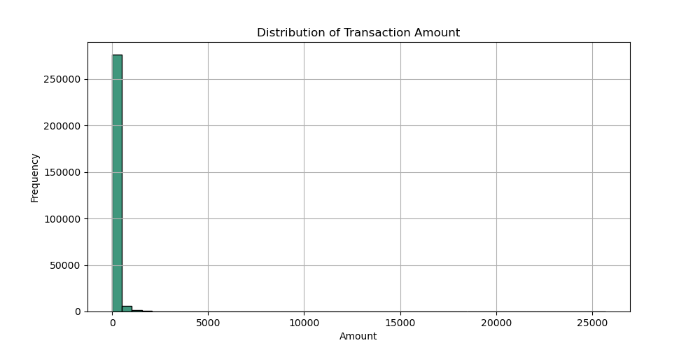
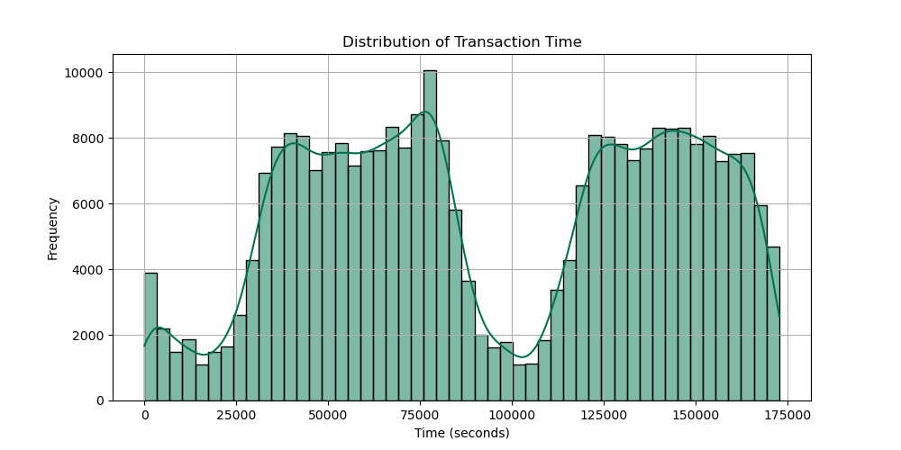
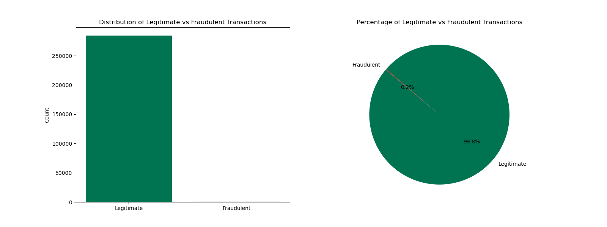
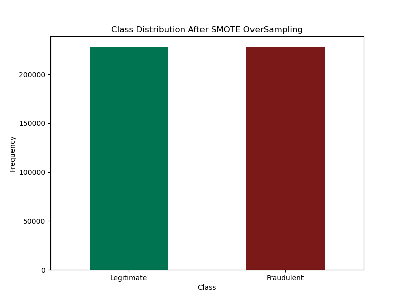

# Credit Card Fraud Detection ML Project

## Introduction
In today's digital age, credit card transactions have become a part of our daily routine. While the convenience of quick payments is great, the risk of fraudulent activities is also increasing. Credit card fraud includes many illicit activities, such as unauthorized purchases and identity theft. The impact of such fraud is far-reaching, affecting not only individuals but also financial institutions and the overall economy.

To address this pressing issue, my project aims to develop a machine-learning model that can identify potentially fraudulent credit card transactions. By analyzing patterns and anomalies in transaction data, our model seeks to provide a robust security measure that enhances the trustworthiness of credit card transactions.

### Problem Statement
The goal is to build a fraud detection system that quickly and reliably spots illegal transactions while minimizing the inconvenience to customers by avoiding false positives.

### Opportunity
We want to build a model that can accurately anticipate fraud by using a comprehensive dataset from Kaggle. Our goal is to increase transaction security, reduce losses, and rebuild confidence in electronic payments so that credit card fraud will become less common in the future.

### Goals
- Preprocess and explore the dataset with features like transaction amount, location, time, and history.
- Split the dataset into training and testing sets & train models (logistic regression and decision trees) on labeled data.
- Evaluate models using precision, recall, and F1 score.
- Improve models by tuning hyperparameters.
- Accurately identify and prevent fraudulent credit card transactions.

## Introduction to Dataset
The dataset is sourced from [Kaggle](https://www.kaggle.com/datasets/mlg-ulb/creditcardfraud) and includes 284,807 transactions. Among these transactions, 492 are fraudulent. Due to the significant class imbalance, special handling is required before building a model.

It is crucial for credit card companies to identify fraudulent transactions to prevent customers from being wrongly charged for items they did not purchase. The transactions were made by European cardholders in September 2013, spanning two days. The dataset contains:
- 284,807 transactions
- 492 fraudulent transactions, representing 0.172% of the total

The dataset includes only numerical input variables derived from a PCA transformation. Due to confidentiality concerns, the original features and additional background information are not provided. Features V1, V2, ..., V28 are the principal components obtained through PCA.

- **Time** and **Amount** are the only features not transformed by PCA. 
  - **Time** indicates the seconds elapsed between each transaction and the first transaction in the dataset.
  - **Amount** is the transaction amount, which can be used for example-dependent cost-sensitive learning.
- **Class** is the response variable, with 1 indicating fraud and 0 indicating a non-fraudulent transaction.

# Exploratory Data Analysis

## Distribution of Transaction Amounts

The distribution of transaction amounts is skewed to the right, with most transactions being small and a few being very large.

### Key Observations:
- **Right-Skewed Distribution:**
  - The distribution of transaction amounts is skewed to the right.
  - Most transactions are small, with a peak around 0, indicating many small transactions.
  - The frequency of high transactions decreases as the amount increases.
  
- **Influence of Large Transactions:**
  - The average transaction amount is influenced by a small number of large transactions.
  
- **Potential Factors:**
  - The distribution may be affected by different transaction types, outliers, or underlying economic factors.

## Distribution of Transaction Time

The histogram of transaction times displays the frequency of transactions occurring at various times. On the x-axis, time is represented in seconds, while the y-axis shows the transaction frequency.

### Key Observations:
- **Bimodal Distribution:** 
  - The histogram reveals a bimodal distribution, indicating two distinct peaks.
  - The first peak is around 80,000 seconds.
  - The second peak is around 130,000 seconds.
  - This implies that transactions are more likely to happen during these two specific time periods.

- **Right-Skewed Distribution:**
  - The distribution is right-skewed, meaning a higher frequency of transactions occurs at later times.
  - This suggests that transactions tend to cluster towards the end of the day or the end of the week.

## Distribution of Classes 

### Key Observations:
- **Class Imbalance:** 
  - 99.83% of the transactions in the dataset are normal, while only 0.17% are fraudulent. 
  - This imbalance highlights the challenge of accurately detecting fraudulent transactions, which are significantly outnumbered by normal ones.

### Analysis of Time and Amount Distribution Classes

- **Time vs Class Scatter Plot:**
  - Reveals no useful information, as both types of transactions are evenly distributed over time.

- **Amount Plot:**
  - Indicates that lower amount transactions are more likely to be fraudulent than higher amount ones.

- **Feature Overlap:**
  - The distributions of most features overlap significantly for both fraudulent and non-fraudulent transactions.

## Exploratory Data Analysis (EDA) Summary

The EDA process has been completed by visualizing key features and using various graphs to better understand the data.

### Key Findings:
- **Normal Transactions:** 99.83% of the transactions in the dataset are normal.
- **Fraudulent Transactions:** Only 0.17% of the transactions are fraudulent.
  - This translates to 492 fraudulent transactions out of 284,807 credit card transactions.

The significant class imbalance makes it challenging to accurately predict fraudulent transactions, as models will tend to favor predicting genuine transactions over fraudulent ones.

### Next Steps:
1. **Model the Data:**
   - Use Logistic Regression to model the data.
2. **Balance the Data:**
   - Implement techniques to address the class imbalance.

# Modelling

## Under Sampling

### Data Distribution Overview

- **Original Distribution:**
  - The initial dataset had many more legitimate transactions (227,451) compared to fraudulent ones (394).

- **Under Sampled Distribution:**
  - After using Random UnderSampler to balance the data, the number of legitimate transactions was reduced to match the number of fraudulent transactions, resulting in 394 legitimate and 394 fraudulent transactions.

The **Random UnderSampler** technique reduces the number of samples in the majority class (legitimate transactions) to match the number of samples in the minority class (fraudulent transactions). This helps balance the dataset, making it easier for the machine learning model to learn and predict both classes accurately. However, it may lead to a loss of information since many legitimate transactions are removed.

Now, the two classes (Legitimate and fraudulent) are balanced.

### Logistic Regression: Using Under Sampling

#### Performance:
- **Accuracy:** The overall accuracy of the model is 96%, which indicates that the model correctly classified 96% of the instances in the dataset.

##### Class 0 (Legitimate Transactions):
- **Precision:** The precision for class 0 is 1.00, meaning that out of all the transactions predicted as legitimate, 100% were actually legitimate.
- **Recall:** The recall for class 0 is 0.96, indicating that out of all the actual legitimate transactions, 96% were correctly identified by the model.
- **F1-Score:** The F1-score for class 0 is 0.98, indicating a good balance between precision and recall for legitimate transactions.

##### Class 1 (Fraudulent Transactions):
- **Precision:** The precision for class 1 is 0.04, meaning that out of all the transactions predicted as fraudulent, only 4% were actually fraudulent.
- **Recall:** The recall for class 1 is 0.92, indicating that out of all the actual fraudulent transactions, 92% were correctly identified by the model.
- **F1-Score:** The F1-score for class 1 is 0.07, which is low due to the significant imbalance between precision and recall for fraudulent transactions.

### Decision Tree: Using Under Sampling

#### Performance:
- **Accuracy:** The overall accuracy of the model is 90%, indicating that the model correctly classified 90% of the instances in the dataset.

##### Class 0 (Legitimate Transactions):
- **Precision:** The precision for class 0 is 1.00, meaning that out of all the transactions predicted as legitimate, 100% were actually legitimate.
- **Recall:** The recall for class 0 is 0.90, indicating that out of all the actual legitimate transactions, 90% were correctly identified by the model.
- **F1-Score:** The F1-score for class 0 is 0.95, indicating a good balance between precision and recall for legitimate transactions.

##### Class 1 (Fraudulent Transactions):
- **Precision:** The precision for class 1 is 0.02, meaning that out of all the transactions predicted as fraudulent, only 2% were actually fraudulent.
- **Recall:** The recall for class 1 is 0.91, indicating that out of all the actual fraudulent transactions, 91% were correctly identified by the model.
- **F1-Score:** The F1-score for class 1 is 0.03, which is low due to the significant imbalance between precision and recall for fraudulent transactions.

## Over Sampling

The second technique used for balancing the dataset is over-sampling using **SMOTE** (Synthetic Minority Over-sampling Technique).

### Data Balancing Using SMOTE

- **Balanced Classes:** The classes were balanced by incorporating more fraudulent transactions through the use of SMOTE (Synthetic Minority Over-sampling Technique).
- **SMOTE Algorithm:** The SMOTE algorithm created new examples of the minority class based on the existing ones and introduced in-between values.
- **New Dataset:** This generated a new dataset with the minority class consisting of 227,451 transactions.

This approach preserves all the valid transactions and improves the model’s performance since it contains more instances of fraud.

### Logistic Regression: Using Over Sampling

#### Performance:
- **Accuracy:** The overall accuracy of the model is 98%, indicating that the model correctly classified 98% of the instances in the dataset.

##### Class 0 (Legitimate Transactions):
- **Precision:** The precision for class 0 is 1.00, meaning that out of all the transactions predicted as legitimate, 100% were actually legitimate.
- **Recall:** The recall for class 0 is 0.98, indicating that out of all the actual legitimate transactions, 98% were correctly identified by the model.
- **F1-Score:** The F1-score for class 0 is 0.99, indicating an excellent balance between precision and recall for legitimate transactions.

##### Class 1 (Fraudulent Transactions):
- **Precision:** The precision for class 1 is 0.08, meaning that out of all the transactions predicted as fraudulent, only 8% were actually fraudulent.
- **Recall:** The recall for class 1 is 0.91, indicating that out of all the actual fraudulent transactions, 91% were correctly identified by the model.
- **F1-Score:** The F1-score for class 1 is 0.14, which is low due to the significant imbalance between precision and recall for fraudulent transactions.

### Decision Tree: Using Over Sampling

#### Performance:
- **Accuracy:** The overall accuracy of the model is 100%, indicating that the model correctly classified all instances in the dataset.

##### Class 0 (Legitimate Transactions):
- **Precision:** The precision for class 0 is 1.00, meaning that out of all the transactions predicted as legitimate, 100% were actually legitimate.
- **Recall:** The recall for class 0 is 1.00, indicating that out of all the actual legitimate transactions, 100% were correctly identified by the model.
- **F1-Score:** The F1-score for class 0 is 1.00, indicating an excellent balance between precision and recall for legitimate transactions.

##### Class 1 (Fraudulent Transactions):
- **Precision:** The precision for class 1 is 0.48, meaning that out of all the transactions predicted as fraudulent, 48% were actually fraudulent.
- **Recall:** The recall for class 1 is 0.82, indicating that out of all the actual fraudulent transactions, 82% were correctly identified by the model.
- **F1-Score:** The F1-score for class 1 is 0.61, which indicates a reasonable balance between precision and recall for fraudulent transactions.

# Improve the Models by Tuning Hyperparameters

## Logistic Regression

### Best Logistic Regression Performance:

#### Performance Metrics

- **Accuracy:** The overall accuracy of the model is 98%, indicating that the model correctly classified the majority of instances in the dataset.

##### Class 0 (Legitimate Transactions)
- **Precision:** The precision for class 0 is 1.00, meaning that out of all the transactions predicted as legitimate, 100% were actually legitimate.
- **Recall:** The recall for class 0 is 0.98, indicating that out of all the actual legitimate transactions, 98% were correctly identified by the model.
- **F1-Score:** The F1-score for class 0 is 0.99, which is the harmonic mean of precision and recall, indicating an excellent balance between the two for legitimate transactions.

##### Class 1 (Fraudulent Transactions)
- **Precision:** The precision for class 1 is 0.08, meaning that out of all the transactions predicted as fraudulent, only 8% were actually fraudulent. This low precision indicates a high number of false positives.
- **Recall:** The recall for class 1 is 0.91, indicating that out of all the actual fraudulent transactions, 91% were correctly identified by the model. This shows that the model captures most of the fraudulent transactions.
- **F1-Score:** The F1-score for class 1 is 0.14, which indicates a poor balance between precision and recall for fraudulent transactions.

## Decision Tree

### Best Decision Tree Performance:

#### Performance Metrics

- **Accuracy:** The overall accuracy of the model is 100%, indicating that the model correctly classified all instances in the dataset.

##### Class 0 (Legitimate Transactions)
- **Precision:** The precision for class 0 is 1.00, meaning that out of all the transactions predicted as legitimate, 100% were actually legitimate.
- **Recall:** The recall for class 0 is 1.00, indicating that out of all the actual legitimate transactions, 100% were correctly identified by the model.
- **F1-Score:** The F1-score for class 0 is 1.00, which is the harmonic mean of precision and recall, indicating an excellent balance between the two for legitimate transactions.

##### Class 1 (Fraudulent Transactions)
- **Precision:** The precision for class 1 is 0.38, meaning that out of all the transactions predicted as fraudulent, 38% were actually fraudulent. This precision indicates a moderate ability to correctly identify fraudulent transactions.
- **Recall:** The recall for class 1 is 0.85, indicating that out of all the actual fraudulent transactions, 85% were correctly identified by the model. This shows that the model captures a substantial portion of fraudulent transactions.
- **F1-Score:** The F1-score for class 1 is 0.52, which indicates a moderate balance between precision and recall for fraudulent transactions.

## Results

### Best Model Performance with Over-Sampling  Report: 

When using over-sampling, all models showed better performance. More data helps improve the models' accuracy. The Decision Tree (Over Sampled) performed the best, achieving an full accuracy of 100%. This model worked exceptionally well with the dataset.

### Decision Tree (Over Sampled) Performance:

- **Accuracy:** The overall accuracy of the model is 100%, indicating that the model correctly classified all instances in the dataset.

#### Class 0 (Legitimate Transactions):

- **Precision:** The precision for class 0 is 1.00, meaning that out of all the transactions predicted as legitimate, 100% were actually legitimate.
- **Recall:** The recall for class 0 is 1.00, indicating that out of all the actual legitimate transactions, 100% were correctly identified by the model.
- **F1-Score:** The F1-score for class 0 is 1.00, which is the harmonic mean of precision and recall, indicating an excellent balance between the two for legitimate transactions.

#### Class 1 (Fraudulent Transactions):

- **Precision:** The precision for class 1 is 0.48, meaning that out of all the transactions predicted as fraudulent, 48% were actually fraudulent. This precision indicates a moderate ability to correctly identify fraudulent transactions.
- **Recall:** The recall for class 1 is 0.82, indicating that out of all the actual fraudulent transactions, 82% were correctly identified by the model. This shows that the model is good at identifying a substantial portion of fraudulent transactions.
- **F1-Score:** The F1-score for class 1 is 0.61, which indicates a reasonable balance between precision and recall for fraudulent transactions.\

## Conclusion

The data was thoroughly investigated by:
- Checking for imbalances
- Visualizing the features
- Checking for null values
- Understanding the relationships between different features

The data was then split into train and test sets.

### Model Performance
- **Logistic Regression and Decision Tree Models:**
  - Both models performed well on the imbalanced dataset.
  - Achieved high precision and recall for legitimate transactions.
  - Showed lower performance for fraudulent transactions.

### Improvements with Sampling Methods

#### Model Performance:
- **Logistic Regression and Decision Tree Models:**
  - Both models performed well on the imbalanced dataset.
  - Achieved high precision and recall for legitimate transactions.
  - Showed lower performance for fraudulent transactions.

#### Improvements with Sampling Methods:
- **Under-Sampling and Over-Sampling:**
  - Improved the recall for fraudulent transactions.
  - Compromised precision and accuracy.

### Fine-Tuning
- Further fine-tuning of the models enhanced their performance.
- Positively impacted both legitimate and fraudulent transactions.